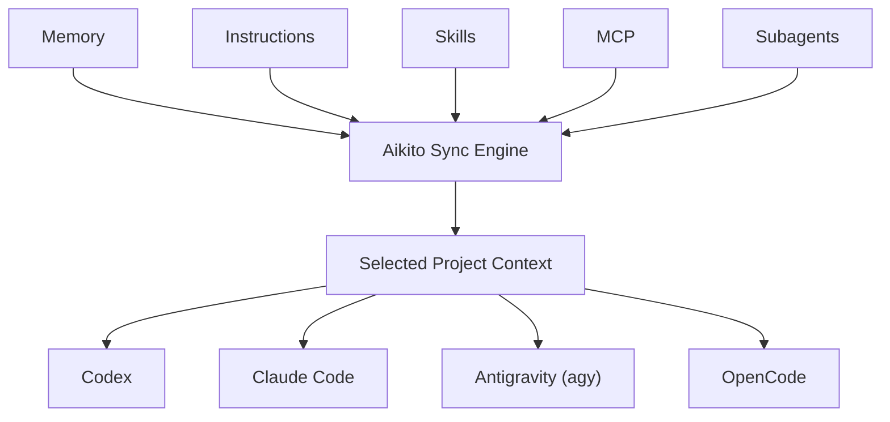
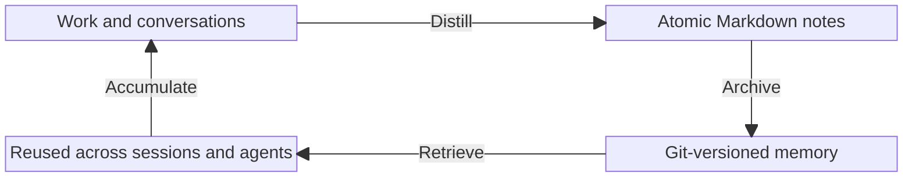

<p align="center">
  <picture>
    <source media="(prefers-color-scheme: dark)" srcset="docs/assets/logo-dark.png">
    <source media="(prefers-color-scheme: light)" srcset="docs/assets/logo-light.png">
    
  </picture>
</p>

<h1 align="center">Aikito</h1>

[](LICENSE)
[](https://www.python.org/downloads/)


[简体中文](README.zh-CN.md) · [Documentation](docs/README.md)

Aikito is a lightweight, Git-managed workspace for reusable AI-agent resources.

Keep durable memory, skills, instructions, MCP servers, and subagents in one
canonical workspace, then share the right resources across your agents and
projects.

Plain files. No database, daemon, vector store, or hosted service required.

## Why Aikito

AI-agent resources become fragmented in three directions:

- across tools, because every agent expects different configuration formats
- across projects, because reusable knowledge, skills, and instructions are
  repeatedly copied or maintained in multiple repositories
- across time, because useful decisions and lessons disappear into old sessions

Aikito keeps those resources in one personal Git workspace and exposes selected
resources to each agent and project:

```text
~/aikito
├── skills/                  reusable across projects
├── memory/                  global durable knowledge
├── global/                  shared instructions
├── mcps.toml                shared MCP definitions
├── subagents/               reusable subagent definitions
└── projects/
    ├── project-a/           selected project resources
    └── project-b/
```

Each project selects the resources it needs from the workspace. It does not need to
become the canonical home of every shared skill or memory note.



## What Aikito Manages

| Resource | Canonical source | Synchronized destination |
| --- | --- | --- |
| Memory | `memory/`, `projects/<name>/memory/` | Global access and `<project>/.agents/memory/` |
| Skills | `skills/<name>/` | Shared and project-level skill directories |
| Instructions | `global/AGENTS.md`, `projects/<name>/AGENTS.md` | Agent-native and project runtime instructions |
| MCP servers | `mcps.toml` | Native TOML, JSON, or JSONC configs |
| Subagents | `subagents.toml`, `subagents/` | Native subagent definitions |

The default registry includes Codex, Claude Code, Antigravity CLI (`agy`), and
OpenCode. See the [architecture](docs/architecture.md) for the complete mental
model and capability boundaries.

### Share or isolate

- `link` keeps a resource shared and immediately up to date
- `copy` gives a project an isolated snapshot it can evolve independently
- memory always remains linked to its canonical scope to preserve one canonical history

## Lightweight by Design

Aikito manages durable files, explicit scopes, and controlled synchronization. It does not require a database, vector store,
embedding pipeline, daemon, MCP memory server, or hosted account.

Memory is stored as ordinary Markdown. Skills and instructions remain ordinary
files. Git provides history, review, rollback, and portability.

Aikito leaves semantic reasoning to the coding agent you already use.

## Durable Memory Workflow

Memory follows the same model: curated Markdown notes live beside the rest of
your agent resources and remain portable across tools.



## Requirements

- macOS or Linux; Windows users should use WSL2.
- Python 3.12, 3.13, or 3.14.
- Git.

Native Windows is not currently supported because Aikito relies on symbolic
links and POSIX file permissions for its synchronization and credential safety
model.

## Quick Start

Install the CLI, initialize your workspace, and synchronize global resources:

```bash
brew install lsaint/tap/aikito

aikito init ~/aikito
aikito sync global
aikito status
```

A synchronized workspace reports resource status across supported agents:

```text
┌───────────────────────┬──────────────┬────────┬────────────┬───────────┐
│ Agent                 │ Instructions │ Skills │ MCP Config │ Subagents │
├───────────────────────┼──────────────┼────────┼────────────┼───────────┤
│ Codex                 │ ✓            │ –      │ –          │ –         │
│ Claude Code           │ ✓            │ ✓ 2    │ –          │ –         │
│ Antigravity CLI (agy) │ ✓            │ ✓ 2    │ –          │ –         │
│ OpenCode              │ ✓            │ –      │ –          │ –         │
└───────────────────────┴──────────────┴────────┴────────────┴───────────┘

Memory Resources
┌───────────────┬───────┬───────┬─────────────────┬─────────────┐
│ Memory Scope  │ Index │ Notes │ Link Target     │ Link Status │
├───────────────┼───────┼───────┼─────────────────┼─────────────┤
│ Global Memory │ ✓     │ 0     │ ~/aikito/memory │ –           │
└───────────────┴───────┴───────┴─────────────────┴─────────────┘

✓ all synced · 4 agents · 2 skills · 0 notes across 1 scopes
```

For building from source, custom installation paths, or advanced configuration options, see the [project setup guide](docs/project-setup.md).

## Migrating an Existing Setup

If you already use coding agents with existing instructions, MCP definitions, or subagents, use `aikito adopt` to import them into your canonical workspace:

```bash
aikito adopt
aikito adopt --apply
```

`aikito adopt` runs a read-only preview first. Applying the plan creates timestamped backups under `~/.aikito/backups/adopt_<timestamp>` and imports detected configurations without overwriting original files. See the [safety guide](docs/safety.md) for complete backup, conflict, and migration details.

## Companion: Chat Distiller

[Chat Distiller](https://github.com/lsaint/chat-distiller) turns browser AI conversations into reviewable Markdown notes and saves them to your Aikito `inbox/`.

Browser conversation → distilled note → review → durable memory

See [capturing browser discussions](docs/chat-distiller.md) for the complete workflow.

## Safety First

`aikito init` creates a local Git repository; it does not make that repository
private or safe to publish. Before adding a remote or pushing, review memory and
configuration for credentials, customer data, internal addresses, private code,
and other sensitive information. Deleting a later commit does not remove a
secret from Git history.

Aikito previews adoption by default, backs up configuration before adoption,
detects managed-entry drift, converts MCP secrets to environment-variable
references, and stops on unmanaged conflicts. Read the full [safety
model](docs/safety.md) before synchronizing an existing setup.

## Deliberate Boundaries

To remain lightweight and portable, Aikito explicitly does not:

- capture every agent action or conversation automatically
- run a vector database or semantic memory service
- inject context into every prompt through a background daemon
- orchestrate supervisor and worker agents
- replace the native runtime of your coding agent

Aikito prepares and governs the workspace. Your chosen agent does the work.

## Comparison

Aikito complements rather than replaces dotfile managers, project-local Agent
sync tools, memory systems, skill registries, and Agent runtimes. Each serves a
different management boundary.

See [Comparison and Design Boundaries](docs/comparison.md) for a neutral overview of manual workflows, dotfiles, agent-specific memory systems, and Aikito.

## Documentation

Browse the [documentation index](docs/README.md) for concepts, operational
guides, the CLI reference, safety details, the roadmap, project background, and [FAQ](docs/faq.md).

## Contributing

Issues and pull requests are welcome. Before submitting code, run:

```bash
python3 -m unittest discover -s tests
```

Report vulnerabilities privately according to the [Security Policy](SECURITY.md).

## License

Aikito is licensed under the [MIT License](LICENSE).
