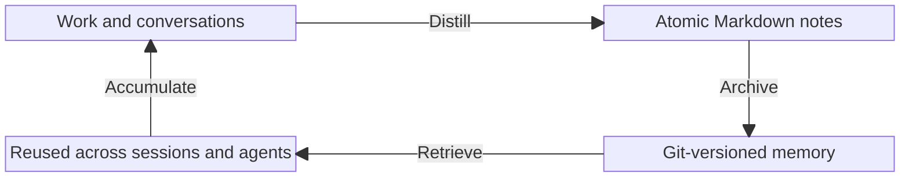

<p align="center">
  <picture>
    <source media="(prefers-color-scheme: dark)" srcset="docs/assets/logo-dark.png">
    <source media="(prefers-color-scheme: light)" srcset="docs/assets/logo-light.png">
    
  </picture>
</p>

<h1 align="center">Aikito</h1>

[](LICENSE)
[](https://www.python.org/downloads/)


[简体中文](README.zh-CN.md) · [Documentation](docs/README.md)

Aikito is a Git-managed workspace and CLI that turns valuable AI-agent
experience into durable memory—versioned, searchable, and reusable across
sessions and agents. It also centrally manages instructions, skills, MCP
servers, and subagents, synchronizing one canonical source to the native
configuration formats of Codex, Claude Code, Antigravity, and OpenCode.

## TL;DR

Aikito keeps reusable memory and Agent resources in one Git-managed workspace,
then makes them available across projects, sessions, and supported coding
agents.

<details>
<summary>Copy this prompt to your coding agent</summary>

> Set up Aikito from https://github.com/lsaint/aikito. Clone the source into
> `~/aikito-src`, then read the README, `skills/aikito/SKILL.md`, and any linked
> documentation relevant to the setup before proceeding.
> Keep the source checkout separate from the `~/aikito` workspace. Initialize
> the workspace, inspect the generated files, and preview any existing Agent
> configuration before importing it. Show me the plan and all conflicts before
> running `aikito adopt --apply` or any `aikito sync ...` command. Never
> overwrite unmanaged configuration or expose credentials. After I approve the
> changes, synchronize the global resources and verify the result with
> `aikito status`.

</details>

## Why Aikito

AI coding agents repeatedly lose useful context between sessions. Switching
between agents compounds the problem because each tool has its own instruction,
skill, MCP, and subagent formats.

Aikito treats accumulated experience as an asset worth versioning. One
canonical workspace holds durable memory and Agent resources, then exposes the
right context to each project and converts configuration into the native format
each supported agent expects.



## What Aikito Manages

| Resource | Canonical source | Synchronized destination |
| --- | --- | --- |
| Memory | `memory/`, `projects/<name>/memory/` | Global access and `<project>/.agents/memory/` |
| Skills | `skills/<name>/` | Shared and project-level skill directories |
| Instructions | `global/AGENTS.md`, `projects/<name>/AGENTS.md` | Agent-native and project runtime instructions |
| MCP servers | `mcps.toml` | Native TOML, JSON, or JSONC configs |
| Subagents | `subagents.toml`, `subagents/` | Native subagent definitions |

The default registry includes Codex, Claude Code, Antigravity CLI (`agy`), and
OpenCode. See the [architecture](docs/architecture.md) for the complete mental
model and capability boundaries.

## Requirements

- macOS or Linux; Windows users should use WSL2.
- Python 3.12, 3.13, or 3.14.
- Git.

Native Windows is not currently supported because Aikito relies on symbolic
links and POSIX file permissions for its synchronization and credential safety
model.

## Quick Start

> Homebrew distribution is planned but not available yet. For now, run the
> Aikito CLI directly from source.

Clone the CLI source separately from the workspace that will contain your data:

```bash
git clone https://github.com/lsaint/aikito.git "$HOME/aikito-src"
export PATH="$HOME/aikito-src/bin:$PATH"
```

The `PATH` change applies to the current shell. Add the export to `~/.zshrc` or
`~/.bashrc` to keep it across sessions, or invoke
`$HOME/aikito-src/bin/aikito` directly.

Create a new Git-managed workspace and inspect it:

```bash
aikito init ~/aikito
aikito status
```

`~/aikito-src` is the CLI source checkout; `~/aikito` is your AI workspace.
They must remain separate. Set `AIKITO_DIR` to use a different workspace path.

A clean initial workspace reports the configured Agent registry with no active
resources and an empty global memory scope:

```text
┌───────────────────────┬──────────────┬────────┬────────────┬───────────┐
│ Agent                 │ Instructions │ Skills │ MCP Config │ Subagents │
├───────────────────────┼──────────────┼────────┼────────────┼───────────┤
│ Codex                 │ –            │ –      │ –          │ –         │
│ Claude Code           │ –            │ –      │ –          │ –         │
│ Antigravity CLI (agy) │ –            │ –      │ –          │ –         │
│ OpenCode              │ –            │ –      │ –          │ –         │
└───────────────────────┴──────────────┴────────┴────────────┴───────────┘

Memory Resources
┌───────────────┬───────┬───────┬─────────────────┬─────────────┐
│ Memory Scope  │ Index │ Notes │ Link Target     │ Link Status │
├───────────────┼───────┼───────┼─────────────────┼─────────────┤
│ Global Memory │ ✓     │ 0     │ ~/aikito/memory │ –           │
└───────────────┴───────┴───────┴─────────────────┴─────────────┘

✓ all synced · 4 agents · 0 skills
  0 notes across 1 scopes
```

### Optional: Adopt Existing Configuration

`aikito adopt` is a read-only preview. Applying the reviewed plan creates
timestamped backups under `~/.aikito/backups/adopt_<timestamp>` and imports
detected instructions, MCP definitions, and subagents into the workspace. It
does not overwrite the original Agent configuration files.

```bash
aikito adopt
aikito adopt --apply
```

Resolve instruction conflicts before applying. Agent-native configuration
changes only when you explicitly run an `aikito sync ...` command.

### Activate Global Resources

Review `global/AGENTS.md`, `skills.toml`, and `agents.toml`, then synchronize and
verify them:

```bash
aikito sync global
aikito status
```

For example, a workspace with two enabled global skills may report:

```text
┌───────────────────────┬──────────────┬────────┬────────────┬───────────┐
│ Agent                 │ Instructions │ Skills │ MCP Config │ Subagents │
├───────────────────────┼──────────────┼────────┼────────────┼───────────┤
│ Codex                 │ ✓            │ –      │ –          │ –         │
│ Claude Code           │ ✓            │ ✓ 2    │ –          │ –         │
│ Antigravity CLI (agy) │ ✓            │ ✓ 2    │ –          │ –         │
│ OpenCode              │ ✓            │ –      │ –          │ –         │
└───────────────────────┴──────────────┴────────┴────────────┴───────────┘
```

Resource counts depend on the workspace configuration. A check mark confirms
that the configured resource is synchronized; a dash means that no resource is
configured for that Agent or the capability is not supported.

Synchronization may create symbolic links in detected Agent configuration
directories. Existing unmanaged files are reported as conflicts and are not
silently overwritten.

## Safety First

`aikito init` creates a local Git repository; it does not make that repository
private or safe to publish. Before adding a remote or pushing, review memory and
configuration for credentials, customer data, internal addresses, private code,
and other sensitive information. Deleting a later commit does not remove a
secret from Git history.

Aikito previews adoption by default, backs up configuration before adoption,
detects managed-entry drift, converts MCP secrets to environment-variable
references, and stops on unmanaged conflicts. Read the full [safety
model](docs/safety.md) before synchronizing an existing setup.

## Documentation

Browse the [documentation index](docs/README.md) for concepts, operational
guides, the CLI reference, safety details, the roadmap, and project background.

## FAQ

### Was Aikito written by AI?

Aikito is developed with AI assistance, but it is not an AI-directed project.
Its author, Ethan St Lee, has 20 years of experience as a software engineer,
architect, and technology director. Aikito grew out of the real problems he
encountered while using coding agents in daily work, including memory that did
not carry across sessions and knowledge and configuration fragmented across agents. The
workflow and tools were developed to solve those problems in practice. He
defines the problems, product direction, architecture, and engineering
trade-offs; understands what the AI is doing; reviews its output; and remains
accountable for the result. AI is an engineering tool here, not a substitute
for judgment.

## Contributing

Issues and pull requests are welcome. Before submitting code, run:

```bash
python3 -m unittest discover -s tests
```

Report vulnerabilities privately according to the [Security Policy](SECURITY.md).

## License

Aikito is licensed under the [MIT License](LICENSE).
