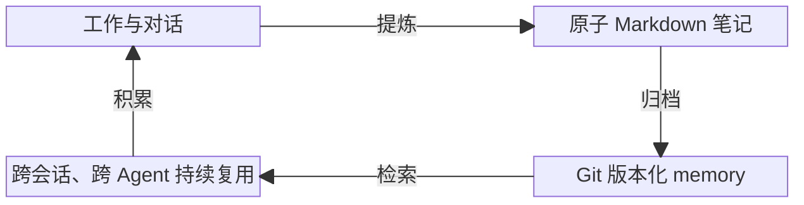

<p align="center">
  <picture>
    <source media="(prefers-color-scheme: dark)" srcset="docs/assets/logo-dark.png">
    <source media="(prefers-color-scheme: light)" srcset="docs/assets/logo-light.png">
    
  </picture>
</p>

<h1 align="center">Aikito</h1>

[](LICENSE)
[](https://www.python.org/downloads/)


[English](README.md) · [详细文档（英文）](docs/README.md)

Aikito 是一套由 Git 管理的 AI Agent 工作区与 CLI，用于把真正值得保留的经验沉淀为
可版本化、可检索、可跨会话、跨 Agent 复用的长期记忆。它还统一管理 instructions、
skills、MCP server 和 subagent，并将唯一规范来源同步为 Codex、Claude Code、
Antigravity 和 OpenCode 的原生配置格式。

## TL;DR

Aikito 把可复用的 memory 和 Agent 资源统一保存在一个由 Git 管理的工作区中，让它们能够
跨项目、跨会话并在不同 Coding Agent 之间持续使用。

<details>
<summary>复制这段提示词给你的 Coding Agent</summary>

> 从 https://github.com/lsaint/aikito 配置 Aikito。将源码克隆到 `~/aikito-src`，然后先
> 阅读源码目录中的 README、`skills/aikito/SKILL.md`，以及与配置任务相关的链接文档。
> 保持源码目录与 `~/aikito` 工作区相互独立。初始化工作区、检查
> 生成的文件，并在导入本机已有 Agent 配置前先进行预览。运行 `aikito adopt --apply` 或任何
> `aikito sync ...` 命令之前，先向我展示执行计划和所有冲突。不要覆盖未受管理的配置，也不要
> 暴露凭据。获得我的确认后，再同步全局资源，并使用 `aikito status` 验证结果。

</details>

## 为什么需要 Aikito？

AI Coding Agent 会在会话之间反复丢失有价值的上下文。切换 Agent 会进一步放大这个问题，
因为每种工具都有自己的 instruction、skill、MCP 和 subagent 格式。

Aikito 把积累下来的经验视为值得版本化的资产。一个规范工作区保存长期 memory 和 Agent
资源，再把正确的上下文提供给各个项目，并转换为每种受支持 Agent 需要的原生配置格式。



> Aikito 仍在积极开发中。Homebrew 分发已经进入规划，但目前尚未提供；当前版本从源码
> 运行 CLI。

## Aikito 管理什么？

| 资源 | 规范来源 | 同步目标 |
| --- | --- | --- |
| Memory | `memory/`、`projects/<name>/memory/` | 全局读取及 `<project>/.agents/memory/` |
| Skills | `skills/<name>/` | 全局和项目 skill 目录 |
| Instructions | `global/AGENTS.md`、`projects/<name>/AGENTS.md` | Agent 原生及项目运行时指令 |
| MCP server | `mcps.toml` | Agent 原生 TOML、JSON 或 JSONC 配置 |
| Subagent | `subagents.toml`、`subagents/` | Agent 原生 subagent 定义 |

默认注册表包含 Codex、Claude Code、Antigravity CLI（`agy`）和 OpenCode。完整心智模型和
能力边界见[架构文档](docs/architecture.md)。

## 环境要求

- macOS 或 Linux；Windows 用户使用 WSL2。
- Python 3.12、3.13 或 3.14。
- Git。

Aikito 的同步和凭据安全模型依赖软链接及 POSIX 文件权限，因此暂不支持原生 Windows。

## 快速开始

将 CLI 源码与保存用户数据的工作区分别放置：

```bash
git clone https://github.com/lsaint/aikito.git "$HOME/aikito-src"
export PATH="$HOME/aikito-src/bin:$PATH"
```

`PATH` 设置只对当前 shell 生效。需要跨会话使用时，请将该 export 写入 `~/.zshrc` 或
`~/.bashrc`，也可以直接运行 `$HOME/aikito-src/bin/aikito`。

创建由 Git 管理的工作区并检查状态：

```bash
aikito init ~/aikito
aikito status
```

`~/aikito-src` 是 CLI 源码目录，`~/aikito` 是 AI 工作区，两者必须保持分离。可以通过
`AIKITO_DIR` 指定其他工作区路径。

全新工作区会显示已经识别的 Agent 注册表、尚未激活的资源，以及空的全局 memory：

```text
┌───────────────────────┬──────────────┬────────┬────────────┬───────────┐
│ Agent                 │ Instructions │ Skills │ MCP Config │ Subagents │
├───────────────────────┼──────────────┼────────┼────────────┼───────────┤
│ Codex                 │ –            │ –      │ –          │ –         │
│ Claude Code           │ –            │ –      │ –          │ –         │
│ Antigravity CLI (agy) │ –            │ –      │ –          │ –         │
│ OpenCode              │ –            │ –      │ –          │ –         │
└───────────────────────┴──────────────┴────────┴────────────┴───────────┘

Memory Resources
┌───────────────┬───────┬───────┬─────────────────┬─────────────┐
│ Memory Scope  │ Index │ Notes │ Link Target     │ Link Status │
├───────────────┼───────┼───────┼─────────────────┼─────────────┤
│ Global Memory │ ✓     │ 0     │ ~/aikito/memory │ –           │
└───────────────┴───────┴───────┴─────────────────┴─────────────┘

✓ all synced · 4 agents · 0 skills
  0 notes across 1 scopes
```

### 可选：导入已有配置

`aikito adopt` 仅做只读预览。执行已检查的计划时，Aikito 会在
`~/.aikito/backups/adopt_<timestamp>` 下创建带时间戳的备份，并将检测到的
instructions、MCP 定义和 subagents 导入工作区；它不会覆盖原始 Agent 配置文件。

```bash
aikito adopt
aikito adopt --apply
```

执行前必须处理 instruction 冲突。只有显式运行 `aikito sync ...`，才会变更 Agent 的
原生配置。

### 激活全局资源

检查 `global/AGENTS.md`、`skills.toml` 和 `agents.toml`，然后同步并验证：

```bash
aikito sync global
aikito status
```

例如，启用了两个全局 skill 的工作区可能显示：

```text
┌───────────────────────┬──────────────┬────────┬────────────┬───────────┐
│ Agent                 │ Instructions │ Skills │ MCP Config │ Subagents │
├───────────────────────┼──────────────┼────────┼────────────┼───────────┤
│ Codex                 │ ✓            │ –      │ –          │ –         │
│ Claude Code           │ ✓            │ ✓ 2    │ –          │ –         │
│ Antigravity CLI (agy) │ ✓            │ ✓ 2    │ –          │ –         │
│ OpenCode              │ ✓            │ –      │ –          │ –         │
└───────────────────────┴──────────────┴────────┴────────────┴───────────┘
```

资源数量取决于工作区配置。勾号表示已配置的资源完成同步；短横线表示该 Agent 未配置对应
资源，或尚不支持该能力。

同步可能在检测到的 Agent 配置目录中创建软链接。遇到未受管理的既有文件时，Aikito 会报告
冲突，不会静默覆盖。

## 安全优先

`aikito init` 创建的是本地 Git 仓库，不会自动将其设为私有，也不代表它可以安全公开。
添加远端或推送前，请检查 memory 和配置中是否包含凭据、客户数据、内部地址、私密源码等
敏感信息。后续删除一次提交并不能从 Git 历史中清除秘密。

Aikito 默认预览配置接管、接管前生成备份、检测受管理条目漂移、将 MCP 密钥转换为环境变量
引用，并在遇到未受管理冲突时停止。同步现有环境前，请阅读完整的[安全模型](docs/safety.md)。

## 设计边界与对比

Aikito 是对传统 dotfiles 和 Agent 原生记忆系统的补充而非替代，不同方案服务于不同的管理边界。

请参阅[设计边界与对比](docs/comparison.md)查看关于手工复制、dotfiles、Agent 专属记忆系统与 Aikito 的中立对比概览。

## 文档

详细文档首版以英文作为规范来源。通过[文档索引](docs/README.md)查看核心概念、操作指南、
CLI 参考、安全模型、路线图和项目背景。

## 常见问题

### Aikito 是 AI 写的吗？

Aikito 使用 AI 辅助开发，但不是由 AI 主导的项目。作者 Ethan St Lee 拥有 20 年软件行业
经验，经历涵盖程序员、架构师和技术总监。Aikito 来自他在日常工作中实际使用 Coding Agent 时
遇到的痛点，包括记忆无法跨会话保留，以及知识和配置散落在不同 Agent 之间。这套工作流和
工具正是在持续解决这些实际问题的过程中形成的。他明确知道自己要解决什么问题，也理解 AI
正在做什么；问题定义、产品方向、架构设计和工程取舍由作者决定，AI 的产出会经过审查，
最终结果也由作者负责。AI 在这里是工程工具，而不是判断力的替代品。

## 关注作者

作者也在微信公众号分享关于 AI、编程、阅读与长期知识积累的实践和思考。欢迎在微信中搜索
「不是很南」关注。

## 参与贡献

欢迎提交 Issue 和 Pull Request。提交代码前请运行：

```bash
python3 -m unittest discover -s tests
```

安全漏洞请按[安全策略](SECURITY.md)私下报告。

## 许可证

Aikito 使用 [MIT License](LICENSE)。
