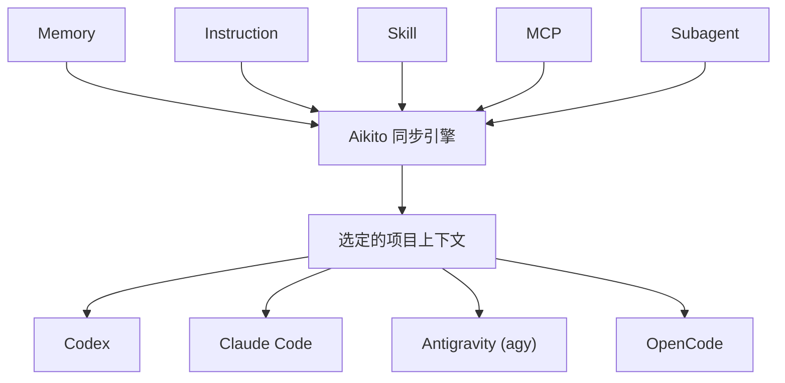
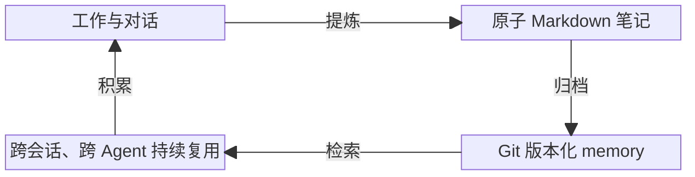

<p align="center">
  <picture>
    <source media="(prefers-color-scheme: dark)" srcset="docs/assets/logo-dark.png">
    <source media="(prefers-color-scheme: light)" srcset="docs/assets/logo-light.png">
    
  </picture>
</p>

<h1 align="center">Aikito</h1>

[](LICENSE)
[](https://www.python.org/downloads/)


[English](README.md) · [详细文档（英文）](docs/README.md)

Aikito 是一套轻量级、由 Git 管理的 AI Agent 可复用资源工作区。

将长期 memory、skill、instruction、MCP server 和 subagent 统一保存在一个规范工作区中，再将合适的资源共享到你的各个 Agent 与项目中。

纯文件架构。无需数据库、后台守护进程、向量数据库或托管服务。

## 为什么需要 Aikito？

AI Agent 资源会在三个方向上变得碎片化：

- 跨工具维度：每种 Agent 都需要不同的配置格式
- 跨项目维度：可复用的知识、skill 与 instruction 在多个仓库中被重复复制或维护
- 跨时间维度：有价值的决策与经验教训随时间消失在旧会话中

Aikito 将这些资源集中在一个个人 Git 工作区中，并将选定的资源暴露给各个 Agent 和项目：

```text
~/aikito
├── skills/                  跨项目复用的 skill
├── memory/                  全局长期知识
├── global/                  共享指令
├── mcps.toml                共享 MCP 定义
├── subagents/               可复用 subagent 定义
└── projects/
    ├── project-a/           选定的项目资源
    └── project-b/
```

每个项目按需从工作区中选择所需资源，不需要成为每个共享 skill 或 memory 笔记的规范存放地。



## Aikito 管理什么？

| 资源 | 规范来源 | 同步目标 |
| --- | --- | --- |
| Memory | `memory/`、`projects/<name>/memory/` | 全局读取及 `<project>/.agents/memory/` |
| Skills | `skills/<name>/` | 全局和项目 skill 目录 |
| Instructions | `global/AGENTS.md`、`projects/<name>/AGENTS.md` | Agent 原生及项目运行时指令 |
| MCP server | `mcps.toml` | Agent 原生 TOML、JSON 或 JSONC 配置 |
| Subagent | `subagents.toml`、`subagents/` | Agent 原生 subagent 定义 |

默认注册表包含 Codex、Claude Code、Antigravity CLI（`agy`）和 OpenCode。完整心智模型和
能力边界见[架构文档](docs/architecture.md)。

### 共享或隔离

- `link` 保持资源共享并实时同步更新
- `copy` 为项目提供可独立演进的隔离快照
- memory 始终与其规范作用域保持链接，以维护统一的规范历史

## 轻量化设计

Aikito 管理持久化文件、显式作用域与可控同步。它不需要数据库、向量数据库、embedding 管线、后台守护进程、MCP memory server 或托管账号。

Memory 以普通 Markdown 格式存储。Skill 和 instruction 保持为普通文件。Git 提供历史记录、审查、回滚和可移植性。

Aikito 将语义推理交给你在使用的 Coding Agent 本身处理。

## 长期 Memory 工作流

Memory 也遵循同样的模型：精心提炼的 Markdown 笔记与其余 Agent 资源存放在一起，在不同工具之间保持可移植。



## 环境要求

- macOS 或 Linux；Windows 用户使用 WSL2。
- Python 3.12、3.13 或 3.14。
- Git。

Aikito 的同步和凭据安全模型依赖软链接及 POSIX 文件权限，因此暂不支持原生 Windows。

## 快速开始

安装 CLI、初始化工作区并同步全局资源：

```bash
brew install lsaint/tap/aikito

aikito init ~/aikito
aikito sync global
aikito status
```

同步完成后，状态面板会展示各个受支持 Agent 的资源状态：

```text
┌───────────────────────┬──────────────┬────────┬────────────┬───────────┐
│ Agent                 │ Instructions │ Skills │ MCP Config │ Subagents │
├───────────────────────┼──────────────┼────────┼────────────┼───────────┤
│ Codex                 │ ✓            │ –      │ –          │ –         │
│ Claude Code           │ ✓            │ ✓ 2    │ –          │ –         │
│ Antigravity CLI (agy) │ ✓            │ ✓ 2    │ –          │ –         │
│ OpenCode              │ ✓            │ –      │ –          │ –         │
└───────────────────────┴──────────────┴────────┴────────────┴───────────┘

Memory Resources
┌───────────────┬───────┬───────┬─────────────────┬─────────────┐
│ Memory Scope  │ Index │ Notes │ Link Target     │ Link Status │
├───────────────┼───────┼───────┼─────────────────┼─────────────┤
│ Global Memory │ ✓     │ 0     │ ~/aikito/memory │ –           │
└───────────────┴───────┴───────┴─────────────────┴─────────────┘

✓ all synced · 4 agents · 2 skills · 0 notes across 1 scopes
```

如需从源码构建、使用自定义安装路径或查看高级参数，请参阅[项目配置指南（英文）](docs/project-setup.md)。

## 迁移现有配置

如果你已经在使用 Coding Agent 并存有已有的 instruction、MCP 定义或 subagent，可以使用 `aikito adopt` 将它们导入规范工作区：

```bash
aikito adopt
aikito adopt --apply
```

`aikito adopt` 会先进行只读预览。应用计划会在 `~/.aikito/backups/adopt_<timestamp>` 下创建带时间戳的备份，并导入检测到的配置，不会覆盖原有文件。详细的备份、冲突与迁移机制见[安全指南（英文）](docs/safety.md)。

## 配套工具：Chat Distiller

[Chat Distiller](https://github.com/lsaint/chat-distiller) 可将浏览器中的 AI 对话提炼为可审阅的 Markdown 笔记，并直接保存至 Aikito 的 `inbox/` 目录。

浏览器 AI 对话 → 提炼笔记 → 审阅归档 → 长期 Memory

完整工作流请参阅[捕捉浏览器 AI 对话（英文）](docs/chat-distiller.md)。

## 安全优先

`aikito init` 创建的是本地 Git 仓库，不会自动将其设为私有，也不代表它可以安全公开。
添加远端或推送前，请检查 memory 和配置中是否包含凭据、客户数据、内部地址、私密源码等
敏感信息。后续删除一次提交并不能从 Git 历史中清除秘密。

Aikito 默认预览配置接管、接管前生成备份、检测受管理条目漂移、将 MCP 密钥转换为环境变量
引用，并在遇到未受管理冲突时停止。同步现有环境前，请阅读完整的[安全模型](docs/safety.md)。

## 设计边界

为了保持轻量与可移植性，Aikito 明确选择不进行以下操作：

- 自动捕获每一个 Agent 操作或对话
- 运行向量数据库或语义检索服务
- 通过后台守护进程向每个 prompt 注入上下文
- 编排 supervisor 与 worker agent 节点
- 替代你所使用的 Coding Agent 的原生运行时

Aikito 负责准备与管控工作区，具体工作由你选定的 Agent 完成。

## 方案对比

Aikito 是对 dotfile 管理工具、单项目 Agent 同步工具、记忆系统、skill 注册表与 Agent 运行时的补充而非替代，不同方案服务于不同的管理边界。

请参阅[设计边界与对比](docs/comparison.md)查看关于手工复制、dotfiles、Agent 专属记忆系统与 Aikito 的中立对比概览。

## 文档

详细文档首版以英文作为规范来源。通过[文档索引](docs/README.md)查看核心概念、操作指南、
CLI 参考、安全模型、路线图、项目背景和[常见问题解答（FAQ，英文）](docs/faq.md)。

## 关注作者

作者也在微信公众号分享关于 AI、编程、阅读与长期知识积累的实践和思考。欢迎在微信中搜索
「不是很南」关注。

## 参与贡献

欢迎提交 Issue 和 Pull Request。提交代码前请运行：

```bash
python3 -m unittest discover -s tests
```

安全漏洞请按[安全策略](SECURITY.md)私下报告。

## 许可证

Aikito 使用 [MIT License](LICENSE)。
