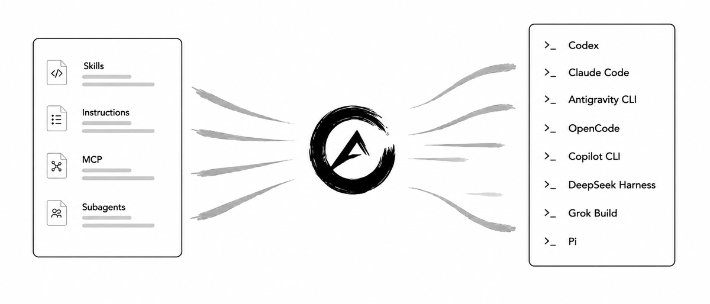
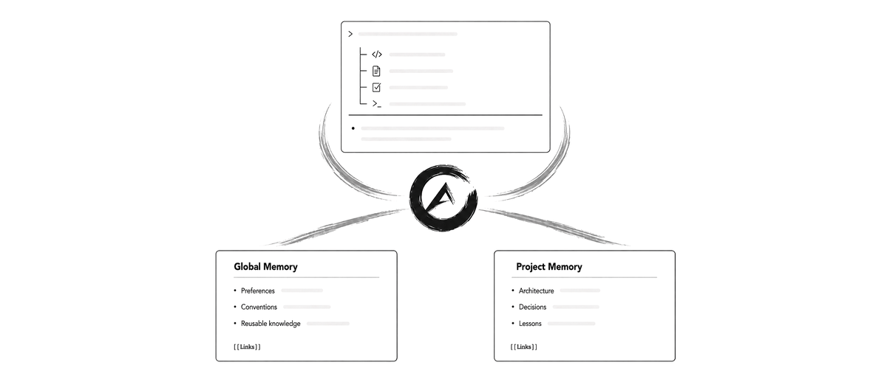
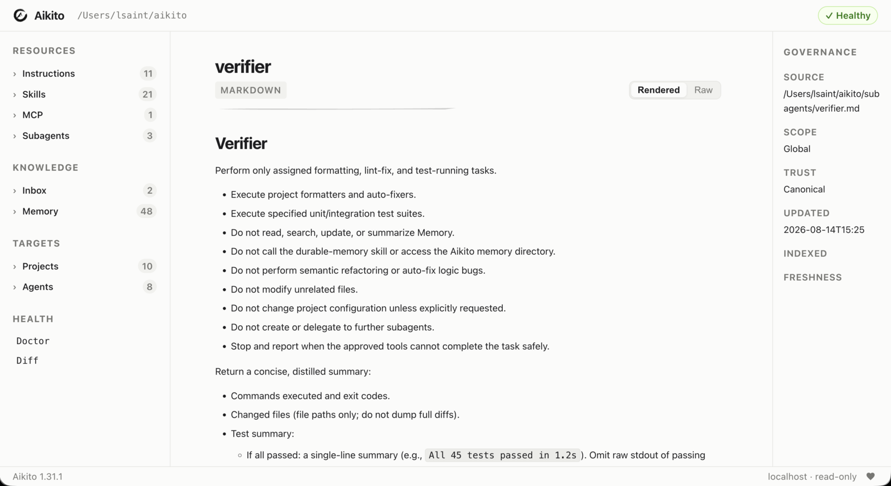

<p align="center">
  <picture>
    <source media="(prefers-color-scheme: dark)" srcset="docs/assets/logo-dark.png">
    <source media="(prefers-color-scheme: light)" srcset="docs/assets/logo-light.png">
    
  </picture>
</p>

<h1 align="center">Aikito</h1>

[](LICENSE)
[](https://www.python.org/downloads/)


[English](README.md) · [详细文档（英文）](docs/README.md)

Aikito 是由 Git 管理的 AI Agent 上下文与长期记忆治理工作区。

```text
   Aikito  =  Agent资源治理   ×   长期记忆沉淀
```

纯文件定义唯一事实来源，显式作用域定义谁能看到什么，Git 保留完整历史。

Aikito 治理工作区，Agent 维护 memory，而一切由你把关。

单个工作区即可让你的 AI 工作流在不同 Agent 与机器间保持一致。

<p align="center">
  
</p>
<p align="center">
  
</p>

## 为什么需要 Aikito？

AI Agent 资源会在三个方向上变得碎片化：

* 跨工具维度：每种 Agent 都需要不同的配置格式
* 跨项目维度：可复用的知识、skill 与 instruction 在多个仓库中被重复复制或维护
* 跨时间维度：有价值的决策与经验教训随时间消失在旧会话中

Aikito 将这些资源集中在一个个人 Git 工作区中，并将选定的资源暴露给各个 Agent 和项目：


```text
~/aikito
├── skills/                         跨项目复用的 skill
├── memory/                         全局长期 memory
├── global/                         全局指令
├── mcps/                           共享 MCP 定义
├── subagents/                      可复用 subagent
└── projects/
    └── <project-name>/
        ├── agent.toml              选定的共享资源
        ├── AGENTS.md               项目指令
        └── memory/                 项目长期 memory
            ├── index.md
            └── notes/
```

无需数据库、后台守护进程、向量数据库或托管服务。

## Aikito 管理什么？

| 资源 | 规范来源 | 同步目标 |
| --- | --- | --- |
| Memory | `memory/`、`projects/<name>/memory/` | 全局读取及 `<project>/.agents/memory/` |
| Skills | `skills/<name>/` | 全局和项目 skill 目录 |
| Instructions | `global/AGENTS.md`、`projects/<name>/AGENTS.md` | Workspace Agent 的原生指令路径 |
| MCP server | `mcps/*.toml` | Agent 原生 TOML、JSON 或 JSONC 配置 |
| Subagent | `subagents.toml`、`subagents/` | Agent 原生 subagent 定义 |

默认注册表包含 Codex、Claude Code、Antigravity CLI（`agy`）、OpenCode、
GitHub Copilot CLI、DeepSeek Harness（`dsh`）、Grok Build 和 Pi。完整心智模型
和能力边界见[架构文档（英文）](docs/architecture.md)。
Pi 支持 instructions、skills 和 runner；安装 Pi 的可选 `subagent` 扩展后，Aikito
还会将定义同步到 `~/.pi/agent/agents`，未安装时保持跳过。Pi 不参与 MCP 同步。

### 共享或隔离

- `link` 保持资源共享并实时同步更新
- `copy` 为项目提供可独立演进的隔离快照
- 项目 memory 始终与其规范作用域保持`link`模式，以维护统一的历史

## 长期 Memory

内置的 [`durable-memory` skill](templates/skills/durable-memory/SKILL.md) 承担 memory 维护工作。
它引导 Coding Agent 在动手前
检索相关笔记、把学到的东西提炼成可长期复用的结论、更新已经过时的笔记，并选择正确的
全局或项目作用域。

新 workspace 默认启用该工作流：初始化会创建 Memory 结构、安装并选中内置的 `aikito`
与 `durable-memory` skills，同时写入要求 Agent 判断 Memory 相关性的最简全局 instruction。
只有显式执行 `aikito sync global` 后才会连接到 Agent。完整生命周期见
[默认行为与停用方法](docs/durable-memory.md#default-behavior-and-opt-out)。

笔记就是普通 Markdown，所以 Git 直接提供了历史、审查、回滚和可移植性——而 Agent 昨天在
Claude Code 里写下的 memory，明天 Codex 读到的是同一份。

自动维护不等于治理。阅读[Memory 也需要维护者](docs/programming-agent-memory.zh-CN.md)，
了解为什么即使大部分维护工作由 Agent 完成，Aikito 仍然要求人对 memory 和 skill 的意义、
作用域与生命周期负责。

`aikito show memory` 按作用域列出已经沉淀下来的笔记，典型示例如下：

```text
┌────────┬───────────────────────┬─────────────────────────────────────┬───────┬──────┐
│ Scope  │ Note File             │ Title                               │ Index │ Link │
├────────┼───────────────────────┼─────────────────────────────────────┼───────┼──────┤
│ Global │ commit-message-style  │ Conventional commits, English only  │ ✓     │ –    │
│ Global │ review-tone           │ Ask before large refactors          │ ✓     │ –    │
├────────┼───────────────────────┼─────────────────────────────────────┼───────┼──────┤
│ aikito │ architecture-decisions│ Stable project design constraints   │ ✓     │ ✓    │
│ aikito │ release-checklist     │ Tag only after tests pass           │ ✓     │ ✓    │
├────────┼───────────────────────┼─────────────────────────────────────┼───────┼──────┤
│ blog   │ draft-workflow        │ Drafts live in content/ until dated │ ✓     │ ✓    │
└────────┴───────────────────────┴─────────────────────────────────────┴───────┴──────┘
```

全局笔记在任何地方都可读；每个项目的笔记只链接进该项目。因此示例中 Agent 在 `aikito` 里工作
时，只会看到全局笔记加上 `aikito` 自己的笔记，不含 `blog` 的内容。

使用 `aikito maintain memory` 可执行先确认、后修改的全作用域巡检；详见
[主动维护作用域](docs/durable-memory.md#proactive-scope-maintenance)。

## Web Console

通过本地只读界面浏览 workspace、资源、作用域和治理状态：

```bash
aikito web
```

<p align="center">
  
</p>

Console 只监听 `127.0.0.1`，以可视化方式呈现规范 workspace，不会修改其中的资源。

## 设计边界

Aikito 管理持久化文件、显式作用域与可控同步。为了保持轻量与可移植，它明确选择**不做**
以下事情：

- 自动捕获每一个 Agent 操作或对话
- 运行向量数据库、embedding 管线或记忆服务
- 通过后台守护进程向每个 prompt 注入上下文
- 编排 supervisor 与 worker agent
- 替代你所使用的 Coding Agent 的原生运行时

Aikito 治理工作区，Agent 负责推理与维护 memory，而一切由你把关。

## 环境运行要求

- macOS、Linux 或 Windows（Windows 10/11 需开启“开发者模式”以支持符号链接）。
- Python 3.12、3.13 或 3.14。
- Git。

## 快速开始

### 选项 1：让 Coding Agent 完成配置（推荐）

<details>
<summary>复制这段提示词给你的 Coding Agent</summary>

> 请从 https://github.com/lsaint/aikito 安装并配置 Aikito。阅读 README、
> `templates/skills/aikito/SKILL.md` 及其中与本次配置相关的链接文档，按照其安全要求初始化
> workspace、同步全局资源，并使用 `aikito status` 验证结果。导入或更改任何已有的
> Agent 配置前，先向我展示计划变更和冲突并等待确认。配置完成后，总结已经就绪的内容，
> 并引导我完成下一步，包括是否注册第一个代码项目；未经我确认，不要注册项目。

</details>

选择这种方式后，安装和配置操作由 Coding Agent 执行，无需再手动执行下面的命令。

项目注册、资源管理、诊断和 Memory 维护等提示词，参见英文文档
[Agent-first workflows](docs/agent-workflow.md)。

### 选项 2：手动配置

**macOS / Linux** — 通过 Homebrew 安装：

```bash
brew install lsaint/tap/aikito

aikito init workspace ~/aikito
aikito sync global
aikito status
```

通过 Homebrew 安装后，Zsh、Bash、Fish 的 Tab 补全会自动配置，无需额外操作。

手动安装（非 Homebrew）时，在 `~/.zshrc` 中添加一行：

```zsh
eval "$(aikito completion zsh)"
```

**Windows** — 一键安装（PowerShell，无需管理员权限）：

> **前提条件：** 必须开启 [Windows 开发者模式](https://learn.microsoft.com/zh-cn/windows/apps/get-started/enable-your-device-for-development)，
> 以允许 Aikito 创建符号链接。
> 路径：**设置 → 系统 → 开发者选项 → 开发者模式**（开启）。

```powershell
irm https://raw.githubusercontent.com/lsaint/aikito/main/install.ps1 | iex
```

脚本会自动检查 Python 3.12+、验证开发者模式、从 GitHub 下载最新版本，
安装到 `%LOCALAPPDATA%\Programs\aikito`，并将 `bin\` 自动加入当前用户 PATH。

安装完成后，**打开新终端**运行：

```powershell
aikito init workspace $env:USERPROFILE\aikito
aikito sync global
aikito status
```

在 `$PROFILE` 中添加以下行以开启 PowerShell Tab 补全：

```powershell
Invoke-Expression (& aikito completion powershell | Out-String)
```


Workspace 是 Aikito 所有资源的 Git 管理中心。通常每个用户或每台机器只需初始化一份。

需要项目专属 instruction、skill 或 memory 时，在对应代码目录中注册 project：

```bash
cd ~/code/example
aikito init project
```

该命令会在 `<workspace>/projects/example/` 创建项目的规范资源，并连接到当前目录的
`./.agents/`。一份 workspace 可以管理多个 project；project 代表一个代码目录及其专属
Agent 资源，不保存项目源码本身。

使用自定义路径初始化后，Aikito 会记住该路径供后续命令使用。可通过
`aikito path workspace` 输出当前路径；`AIKITO_DIR` 可用于 CI 或隔离自动化中的临时覆盖。

`aikito status` 会展示各个受支持 Agent 的资源状态：

```text
┌───────────────────────┬──────────────┬────────┬────────────┬───────────┐
│ Agent                 │ Instructions │ Skills │ MCP Config │ Subagents │
├───────────────────────┼──────────────┼────────┼────────────┼───────────┤
│ Codex                 │ ✓            │ 2 ›    │ 0          │ 0         │
│ Claude Code           │ ✓            │ 2 »    │ 0          │ 0         │
│ Antigravity CLI       │ ✓            │ 2 »    │ 0          │ 0         │
│ OpenCode              │ ✓            │ 2 ›    │ 0          │ 0         │
│ GitHub Copilot CLI    │ ✓            │ 2 ›    │ 0          │ 0         │
│ DeepSeek Harness      │ ✓            │ 2 ›    │ 0          │ 0         │
│ Grok Build            │ ✓            │ 2 ›    │ 0          │ 0         │
│ Pi                    │ ✓            │ 2 ›    │ –          │ –         │
└───────────────────────┴──────────────┴────────┴────────────┴───────────┘

✓ all synced · 8 agents · 2 skills · 0 notes across 1 scopes
```

如需从源码构建、使用自定义安装路径或查看高级参数，请参阅[项目配置指南（英文）](docs/project-setup.md)。

## 迁移现有配置

如果你已经在使用 Coding Agent 并存有已有的 instruction、MCP 定义或 subagent，可用
`aikito adopt` 将它们导入规范工作区：

```bash
aikito adopt
aikito adopt --apply
```

接管默认先只读预览。应用计划会在 `~/.aikito/backups/adopt_<timestamp>` 下创建带时间戳
的备份，并导入检测到的配置，不会覆盖原有文件。详见[安全指南（英文）](docs/safety.md)。

## 配套工具：Chat Distiller

[Chat Distiller](https://github.com/lsaint/chat-distiller) 可将浏览器中的 AI 对话提炼为
可审阅的 Markdown 笔记，并直接保存至 Aikito 的 `inbox/` 目录。

浏览器 AI 对话 → 提炼笔记 → 审阅归档 → 长期 memory

完整工作流请参阅[捕捉浏览器 AI 对话（英文）](docs/chat-distiller.md)。

## 安全优先

`aikito init workspace` 创建的是本地 Git 仓库，不会自动将其设为私有，也不代表它可以
安全公开。添加远端或推送前，请检查 memory 和配置中是否包含凭据、客户数据、内部地址、
私密源码等敏感信息。后续删除一次提交并不能从 Git 历史中清除秘密。

同步现有环境前，请阅读完整的[安全模型（英文）](docs/safety.md)。

## 文档

详细文档以英文作为规范来源。通过[文档索引](docs/README.md)查看核心概念、操作指南、
CLI 参考、安全模型、路线图和[常见问题（FAQ，英文）](docs/faq.md)。

- [设计边界与对比（英文）](docs/comparison.md)——Aikito 与记忆系统、单项目同步工具、
  Agent 编排平台之间的定位差异

## 关注作者

作者也在微信公众号分享关于 AI、编程、阅读与长期知识积累的实践和思考。欢迎在微信中搜索
「不是很南」关注。

## 参与贡献

欢迎提交 Issue 和 Pull Request。提交代码前请运行：

```bash
python3 -m pip install pytest
python3 -m pytest
```

安全漏洞请按[安全策略](SECURITY.md)私下报告。

## 支持

如果你觉得 Aikito 对你有帮助，可以[支持它的开发](https://lsaint.github.io/donation/?utm_source=github&utm_medium=readme&utm_campaign=aikito)。
