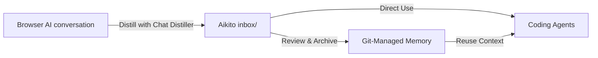

# Capture Browser Conversations with [Chat Distiller](https://github.com/lsaint/chat-distiller)

[Chat Distiller](https://github.com/lsaint/chat-distiller) is Aikito's optional
browser companion. It distills a supported browser AI conversation into concise
Markdown and saves the result directly to a local directory you authorize.

[Chat Distiller](https://github.com/lsaint/chat-distiller) handles capture.
Aikito handles review, scoping, Git history, retrieval, and reuse across
projects, sessions, and coding agents. Neither tool requires the other:
[Chat Distiller](https://github.com/lsaint/chat-distiller) also works with
Obsidian vaults, ordinary Git repositories, and other local Markdown knowledge
bases.

## Recommended Workflow

1. Install [Chat Distiller](https://github.com/lsaint/chat-distiller) and
   authorize the root of your Aikito workspace.
2. Keep its default save subdirectory as `inbox`.
3. From a supported conversation, run **Generate and save**.
4. Decide the note's path based on your task:
   - **For immediate tasks**: Let a coding agent read notes directly from `inbox/` without committing raw drafts.
   - **For durable knowledge**: Review the Markdown in `inbox/`, correct inaccuracies, and move verified conclusions into `memory/` or `projects/<name>/memory/`.
5. Link durable memory notes from that scope's `index.md` when useful.
6. Commit verified memory changes with Git.

## What `inbox/` Means

`inbox/` is a gitignored staging area for browser-distilled notes that have not yet been classified or accepted as durable memory.

Its contents serve two complementary purposes:

1. **Immediate task input**: Coding agents can inspect notes in `inbox/` directly to carry out single-session tasks.
2. **Staging for review**: Raw distilled notes remain uncommitted until reviewed, preventing temporary context or unverified ideas from polluting Git history.

Agents should not treat notes remaining inside `inbox/` as established project constraints merely because they exist.

After review for long-term storage:

- put cross-project knowledge in `memory/notes/`;
- put project-specific knowledge in `projects/<name>/memory/notes/`;
- discard transient, unverified, duplicated, or low-value material.

Prefer one stable conclusion per memory note. Keep each `index.md` as navigation
instead of copying the note body into it. See [Memory workflow](memory-workflow.md)
for the full persistence criteria and [Work with memory](durable-memory.md) for
the operational commands.

## Trust Boundary

[Chat Distiller](https://github.com/lsaint/chat-distiller) writes only to a
directory the user explicitly authorizes. Its generated notes still originate
from an AI response and must be reviewed before they become durable memory. Do
not place credentials, tokens, private keys, or other secrets in `inbox/` or
memory.

The extension currently bundles a ChatGPT adapter. Refer to the
[Chat Distiller](https://github.com/lsaint/chat-distiller)
repository for its current installation status, supported sites, permissions,
privacy policy, and source-installation instructions.
