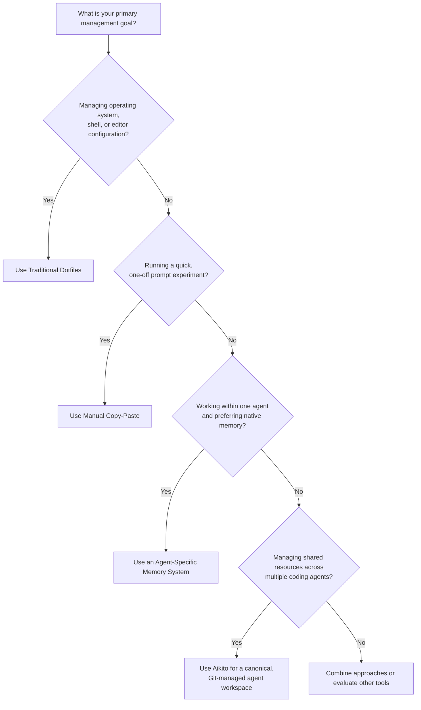

# Comparison and Design Boundaries

Different approaches exist for managing configurations, context, and persistent knowledge for AI coding agents. This document compares **Manual Copy-Paste**, **Traditional Dotfiles**, **Agent-Specific Memory Systems**, and **Aikito** strictly on their **design goals, structural boundaries, and trade-offs**, without evaluating relative product quality.

---

## At a Glance

| Dimension | Manual Copy-Paste | Traditional Dotfiles | Agent-Specific Memory Systems | Aikito |
| --- | --- | --- | --- | --- |
| **Primary Focus** | Ad-hoc sharing and quick trials | Filesystem-oriented system and CLI configuration | Context persistence within one agent ecosystem | Multi-agent workspace and resource synchronization |
| **Source of Truth** | Scattered files, messages, or chat windows | Usually a Git-managed dotfiles repository | Agent-internal storage, database, or files | Canonical Git workspace, typically `~/aikito` |
| **Multi-Agent Support** | Manual duplication per tool | User-defined scripts and templates | Usually tied to one agent | Capability-based translation across supported agents |
| **Managed Resources** | Prompt snippets and individual files | Configuration files, links, and templates | Primarily memory and conversation context | Memory, skills, instructions, MCP servers, and subagents |
| **Scope Model** | Manual placement and naming | Filesystem paths and user-defined profiles | Agent-dependent | Explicit global and project-level scopes |
| **Review & Audit Model** | Manual inspection | Git diff and review | Tool-dependent | Explicit file review, Git history, and controlled adoption |
| **Conflict Handling** | Manual replacement | Tool- or script-dependent | Tool-dependent | Adoption plans, fingerprint drift checks, and safety gates |

---

## Detailed Boundaries

### 1. Manual Copy-Paste

#### Design Intent
Manual copying is the default entry point for experimenting with AI agents. Developers copy system prompts, custom instructions, or project rules directly into chat boxes or local config files (`CLAUDE.md`, `.cursorrules`, etc.).

#### Characteristics
* Zero overhead; no extra tools or dependencies required.
* Ideal for isolated, one-off trials or temporary prompt variations.

#### Boundaries & Trade-offs
* **Scalability**: High manual effort as the number of agents and projects grows.
* **Synchronization**: No automatic drift detection, version control, or synchronization across tools.
* **Fragmentation**: Knowledge easily becomes stale or inconsistent across environments.

---

### 2. Traditional Dotfiles

#### Design Intent
Dotfiles repositories are primarily designed to version and deploy filesystem-oriented configurations (e.g., shell profiles, editor settings, terminal multiplexers) across machines.

#### Characteristics
* Proven model for Unix tool management, versioned via Git, and highly customizable.
* Dotfile managers primarily operate on files, paths, links, and templates.

#### Boundaries & Trade-offs
* **File-Centric vs. Resource-Centric**: Dotfiles track files at specific filesystem paths. They do not model higher-level agent concepts like MCP servers, subagents, or capability-based agent registries.
* **No Built-in Resource Translation**: Basic dotfile managers sync exact file contents. Templates or custom scripts can translate formats, but users must design and maintain the agent resource model and conversion logic themselves.
* **Safety & Conflict Detection**: Conflict behavior depends on the selected dotfile manager and custom deployment scripts; there is no shared safety model specific to agent-managed resources.

---

### 3. Agent-Specific Memory Systems

#### Design Intent
Agent-specific memory features (e.g., built-in auto-memory in specific CLI agents, IDE extensions, or agent memory plugins) aim to provide frictionless context retention within a single tool's ecosystem.

#### Characteristics
* Seamless setup and native integration.
* Automated memory capture during chat sessions within the supported agent environment.

#### Boundaries & Trade-offs
* **Limited Portability**: Plain-text memory may be readable by other tools, but agent-specific discovery, scope, metadata, and synchronization conventions are not generally portable.
* **Resource Breadth**: Typically focused exclusively on conversation memory notes, leaving skills, MCP servers, subagents, and instruction files to be managed separately.
* **Curation & Growth**: Automated memory accumulation may require separate curation policies to control duplication, staleness, and context growth over time.

---

### 4. Aikito

#### Design Intent
Aikito is designed as a **canonical workspace and synchronization engine** for developers using multiple coding agents. It separates CLI tool execution from a Git-managed stateful workspace (typically `~/aikito`), centralizing durable memory, skills, instructions, MCP servers, and subagents in one place.

#### Characteristics
* **Cross-Agent Normalization**: Translates canonical configurations into native runtime formats for supported agents (Codex, Claude Code, Antigravity `agy`, OpenCode). Support is capability-based, so resource coverage differs by agent; see the [architecture](architecture.md).
* **Hierarchical Scope**: Explicitly manages global knowledge vs. project-specific `.agents/` context.
* **Durable Memory Distillation**: Encourages atomic, versioned Markdown notes reviewed via Git, making uncurated memory growth visible and easier to limit.
* **Safety-First Sync**: Includes adopt workflows, fingerprint drift detection, and credential isolation.

#### Boundaries & Trade-offs
* **Not a Real-time Vector DB / RAG System**: Aikito is an agent workspace and file-based context manager, not an in-memory vector database or semantic search server.
* **Capability Asymmetry**: Supported agents do not expose identical resource models. Aikito normalizes only the capabilities available for each agent, so synchronization does not imply full feature parity across runtimes.
* **File-Based Context Boundary**: Aikito manages durable files and configurations. It does not automatically decide which memory should be injected into every prompt or session; runtime context loading remains subject to each agent's behavior.
* **POSIX Environment Dependency**: Relies on POSIX file permissions and symbolic links, requiring macOS, Linux, or WSL2.
* **Requires Initial Setup**: Requires initializing a dedicated workspace directory (`~/aikito`) and maintaining a clean separation between source code and state.

---

## Scenario Guide

* **Choose Manual Copy-Paste** when conducting quick experiments or testing isolated prompt variations in a single session.
* **Choose Traditional Dotfiles** when managing core operating system tools, shell aliases, and editor preferences across machines.
* **Choose Agent-Specific Memory Systems** when working strictly within one vendor ecosystem and preferring automated, low-overhead context tracking.
* **Choose Aikito** when using multiple coding agents across diverse projects, needing centralized Git control over instructions, skills, MCP servers, subagents, and versioned durable knowledge.
