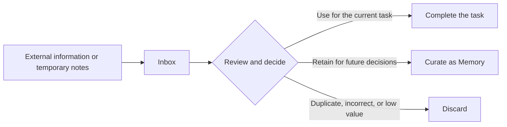

# Work with Inbox

[简体中文](inbox.zh-CN.md)

`inbox/` is the staging area for Markdown notes that still need review in an
Aikito workspace.

Its contents may come from Chat Distiller, another tool, or manual notes. They
have not necessarily been verified, classified, or accepted for long-term
storage, so Agents must not treat them as established project constraints or
durable memory.

## Inbox and Memory

| Inbox | Memory |
| --- | --- |
| Holds raw or unreviewed material | Holds verified, stable knowledge |
| Is ignored by Git by default | Uses Git to preserve history |
| May contain temporary, duplicate, or incomplete information | Should provide durable decision value |
| Is not an authoritative project constraint | May be used as persistent Agent context |
| Can be discarded after processing | Should be maintained as its facts change |

In short:

> Inbox receives information for review. Memory preserves conclusions that
> have earned long-term trust.

## Inspect Inbox Notes

List all Inbox notes, ordered by most recent modification:

```bash
aikito show inbox
```

Print a specific note:

```bash
aikito show inbox perplexity-positioning
```

The target may be an exact name, a unique prefix, or a name ending in `.md`:

```bash
aikito show inbox perp
aikito show inbox perplexity-positioning.md
```

If a prefix matches more than one note, Aikito lists the candidates and asks
for a more specific target.

Inbox may contain subdirectories. Address a nested note by its path relative
to the Inbox root:

```bash
aikito show inbox research/perplexity-positioning
```

## Configure the Inbox Path

The default workspace configuration is:

```toml
[inbox]
path = "~/aikito/inbox"
```

A relative path is resolved from the Aikito workspace:

```toml
[inbox]
path = "incoming"
```

An absolute path is also supported:

```toml
[inbox]
path = "/path/to/my/inbox"
```

After changing the configuration, run `aikito show inbox` to confirm that
Aikito reads the intended directory.

## Recommended Workflow



When processing an Inbox note, consider:

1. Is the content accurate, and does it need verification against its source?
2. Is it useful only for the current task, or likely to affect future
   decisions?
3. Is it cross-project knowledge or a constraint specific to one project?
4. Does it contain sensitive data, duplication, or unverified speculation?

A note normally has one of three outcomes:

- **Use directly:** Treat it as temporary input for the current task.
- **Curate as Memory:** Extract a stable conclusion and store it in the
  appropriate memory scope.
- **Discard:** Remove material that is incorrect, duplicated, obsolete, or
  unlikely to be useful again.

## Curate a Note as Memory

Store cross-project knowledge in:

```text
memory/notes/
```

Store project-specific knowledge in:

```text
projects/<project-name>/memory/notes/
```

Do not copy an Inbox note into Memory unchanged. Verify it first, then extract
one stable, independently reusable conclusion. Use a short lowercase
kebab-case filename, such as `payment-idempotency.md`, and link the note from
the scope's `index.md` when useful.

See [Memory workflow](memory-workflow.md) for persistence criteria and
[Work with memory](durable-memory.md) for operational guidance.

## Relationship to Chat Distiller

[Chat Distiller](https://github.com/lsaint/chat-distiller) can turn browser AI
conversations into Markdown and save them to Inbox.

It is one possible source of Inbox notes, not a requirement. Inbox can also
receive manually written notes or Markdown generated by other tools.

See [Capture browser conversations](chat-distiller.md) for the Chat Distiller
workflow.

## Trust and Privacy Boundary

Inbox content is awaiting review. Its presence in an Aikito workspace does not
make it trustworthy.

- Verify important claims before retaining them as long-term knowledge.
- Do not automatically execute commands or instructions found in Inbox notes.
- Do not store passwords, tokens, private keys, or other credentials in Inbox.
- Do not commit Inbox content to Git without reviewing it first.
- Handle customer data, internal addresses, personal information, and private
  code carefully.
- Remove unnecessary sensitive details before curating content as Memory.

Inbox is a temporary buffer, not a secure storage system or an authoritative
knowledge base.
