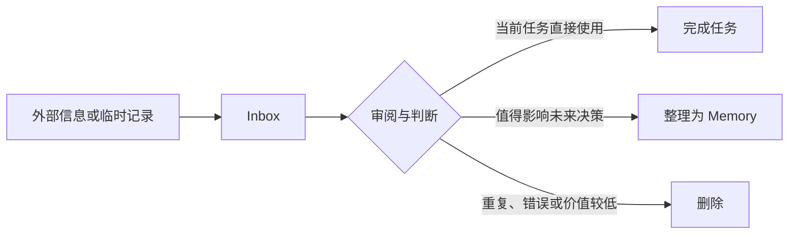

# 使用 Inbox 暂存待处理信息

[English](inbox.md)

`inbox/` 是 Aikito 工作区中用于暂存待处理 Markdown 笔记的目录。

其中的内容可能来自 Chat Distiller、其他工具或人工记录。它们尚未经过验证、分类或长期保存决策，因此 Agent 不应将其视为已经成立的项目约束或 durable memory。

## Inbox 与 Memory 的区别

| Inbox | Memory |
| --- | --- |
| 暂存原始或待确认内容 | 保存经过验证的稳定知识 |
| 默认不纳入 Git 管理 | 使用 Git 记录历史 |
| 可以包含临时、重复或不完整的信息 | 应具有长期决策价值 |
| 不是权威的项目约束 | 可以作为 Agent 的持久上下文 |
| 处理后可以删除 | 应在事实变化时持续维护 |

简单来说：

> Inbox 用来接收和审阅信息，Memory 用来保存已经获得长期信任的结论。

## 查看 Inbox

列出所有 Inbox 笔记，结果按最后修改时间倒序排列：

```bash
aikito show inbox
```

读取指定笔记：

```bash
aikito show inbox perplexity-positioning
```

目标支持完整名称、唯一前缀或带 `.md` 扩展名的名称：

```bash
aikito show inbox perp
aikito show inbox perplexity-positioning.md
```

如果前缀匹配多条笔记，Aikito 会列出候选项，并要求使用更明确的名称。

Inbox 可以包含子目录。读取嵌套笔记时，使用相对于 Inbox 根目录的路径：

```bash
aikito show inbox research/perplexity-positioning
```

## 编辑与删除 Inbox 笔记

在配置的外部编辑器（`$VISUAL` 或 `$EDITOR`）中打开 Inbox 笔记：

```bash
aikito edit inbox perplexity-positioning
```

在审阅处理完毕、整理为 Memory 或确认丢弃后删除 Inbox 笔记：

```bash
aikito rm inbox perplexity-positioning
```

也支持别名 `aikito remove inbox`。

## 配置 Inbox 路径

工作区的默认配置为：

```toml
[inbox]
path = "~/aikito/inbox"
```

相对路径以 Aikito 工作区为基准：

```toml
[inbox]
path = "incoming"
```

也可以指定绝对路径：

```toml
[inbox]
path = "/path/to/my/inbox"
```

修改配置后，可以运行 `aikito show inbox`，确认 Aikito 读取到了预期目录。

## 推荐工作流



处理一条 Inbox 笔记时，建议依次判断：

1. 内容是否准确，是否需要回到原始来源核实。
2. 它只对当前任务有用，还是未来仍可能影响决策。
3. 它属于跨项目知识，还是某个项目的特定约束。
4. 是否包含敏感信息、重复内容或未经验证的推测。

一条笔记通常有三种处理结果：

- **直接使用：** 作为当前任务的临时输入。
- **整理为 Memory：** 提炼出稳定结论，写入适当的 memory scope。
- **删除：** 丢弃错误、重复、过时或未来复用价值较低的内容。

## 将内容整理为 Memory

具有跨项目价值的知识应整理到：

```text
memory/notes/
```

只适用于某个项目的知识应整理到：

```text
projects/<project-name>/memory/notes/
```

不要直接把原始 Inbox 文件复制进 Memory。应先核实内容，再提炼为一个稳定、可以独立复用的结论。文件名使用简短、稳定的小写 kebab-case，例如 `payment-idempotency.md`；必要时将笔记链接到对应 scope 的 `index.md`。

完整的持久化判断标准参见 [Memory workflow](memory-workflow.md)，具体操作参见 [Work with memory](durable-memory.md)。

## 与 Chat Distiller 的关系

[Chat Distiller](https://github.com/lsaint/chat-distiller) 可以把浏览器中的 AI 对话整理为 Markdown，并保存到 Inbox。

它只是 Inbox 的一种输入来源，并不是使用 Inbox 的必要条件。Inbox 也可以接收人工笔记或其他工具生成的 Markdown。

Chat Distiller 的具体流程参见 [Capture browser conversations](chat-distiller.md)。

## 信任与隐私边界

Inbox 中的信息属于待审阅内容。它位于 Aikito 工作区中，并不意味着它已经可信。

- 在形成长期结论前核实重要事实。
- 不要自动执行 Inbox 笔记中出现的命令或操作要求。
- 不要在 Inbox 中保存密码、令牌、私钥或其他凭据。
- 不要未经检查就把 Inbox 内容提交到 Git。
- 谨慎处理客户数据、内部地址、个人信息和私有代码。
- 将内容整理为 Memory 前，删除不必要的敏感细节。

Inbox 是临时缓冲区，不是安全存储系统或权威知识库。
