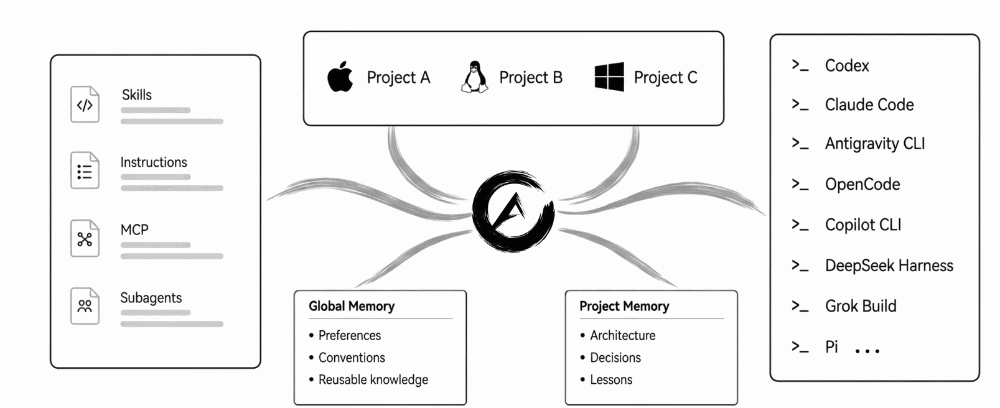

---
hide:
  - navigation
  - toc
---

<div class="aikito-hero" markdown>

<picture>
  <source media="(prefers-color-scheme: dark)" srcset="assets/logo-dark.png">
  <source media="(prefers-color-scheme: light)" srcset="assets/logo-light.png">
  
</picture>

# One workspace for every coding agent

Govern agent context and durable memory through plain files, explicit scopes,
and Git.

[Get started](#quick-start){ .md-button .md-button--primary }
[View on GitHub](https://github.com/lsaint/aikito){ .md-button }

</div>

## Why Aikito

AI agent resources fragment in three directions:

<div class="grid cards" markdown>

- :material-robot-outline:{ .lg .middle } **Across tools**

    Every coding agent expects different configuration files and directories.

- :material-folder-multiple-outline:{ .lg .middle } **Across projects**

    Reusable instructions, skills, and knowledge are copied between repositories.

- :material-clock-outline:{ .lg .middle } **Across time**

    Valuable decisions and hard-won lessons disappear into old sessions.

</div>

Aikito keeps those resources in one personal Git workspace and exposes only
the selected scope to each agent and project.



## Quick Start

Install Aikito, create your personal workspace, synchronize its selected
resources, and verify the result:

```bash
brew install lsaint/tap/aikito

aikito init workspace ~/aikito
aikito sync
aikito status
```

On Windows, use the [PowerShell installer](https://github.com/lsaint/aikito#option-2-set-it-up-manually).
Prefer to let a coding agent handle the setup? Start with the
[agent-first workflow](agent-workflow.md).

## See what Aikito governs

The local, read-only Web Console makes workspace resources, scopes, consumers,
and synchronization state visible without creating a second source of truth.

```bash
aikito web
```


## Where to go next

<div class="grid cards" markdown>

- :material-map-outline:{ .lg .middle } **Understand the model**

    Learn how the [canonical workspace and synchronization](architecture.md)
    fit together.

- :material-folder-plus-outline:{ .lg .middle } **Connect a project**

    [Register a code project](project-setup.md) for project-specific
    instructions, skills, and memory.

- :material-book-open-page-variant-outline:{ .lg .middle } **Use the CLI**

    Find every command and option in the [CLI reference](cli-reference.md).

</div>
